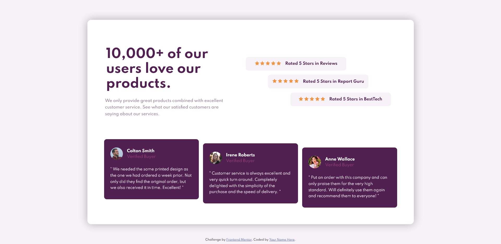

# Frontend Mentor - Social proof section

this is my coding challenge solution for Frontend Mentor's [Social Proof Section](https://www.frontendmentor.io/challenges/social-proof-section-6e0qTv_bA)

## Welcome! 👋

Thanks for checking out this front-end coding challenge solution.

## Table of contents

- [Overview](#overview)
  - [The challenge](#the-challenge)
  - [Screenshot](#screenshot)
  - [Links](#links)
- [My process](#my-process)
  - [Built with](#built-with)
- [Author](#author)

## Overview

in this solution, i use both flexbox and grid. i also take the mobile-first route and tbh, it's somewhat confusing for me. i'm still not used to the mobile-first approach yet.

### The challenge

Your challenge is to build out this social proof section and get it looking as close to the design as possible.

You can use any tools you like to help you complete the challenge. So if you've got something you'd like to practice, feel free to give it a go.

Your users should be able to:

- View the optimal layout for the section depending on their device's screen size

### Screenshot

### Links

- Solution URL: [On Frontend Mentor](https://www.frontendmentor.io/solutions/social-proof-section-html-scss-flexbox-grid-mobilefirst-CGz0YN4SL)
- Live Site URL: [Live Demo](https://captkraken.github.io/social-proof-section)

## My process

Started out with HTML then went the mobile-first route. After that, started modifying things to fix the problems.

in this solution, there are several media queries: @254px, @normal(mobile), @800px, @1080px, @1200px. @254px, i just put profile picture on top of the name and verified buyer.

### Built with

- HTML5
- Sass
- Flexbox
- Grid

## Author

- Website - [My Github](https://github.com/CaptKraken)
- Frontend Mentor - [@CaptKraken](https://www.frontendmentor.io/profile/CaptKraken)
